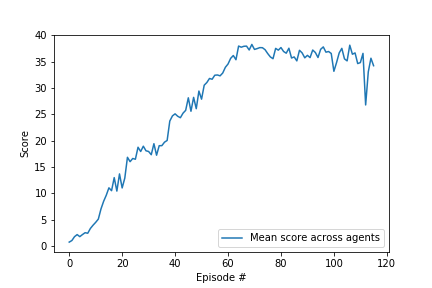

## Deep reinforcement learning: Continuous control with Reacher

### Goal

The goal of this project is to train an a double-jointed arm agent to move to target locations. There are 20 of identical arm agents acting in parallel, each in its own independent environment.

The **state space** has 33 dimensions corresponding to position, rotation, velocity, and angular velocities of the arm.

The **action space** has 4 continous dimensions between -1 and 1, corresponding to torque at each joint. 

A **reward** of +0.1 is provided for each step that the agent's hand is in the goal location. The task is episodic. 

The problem is considered solved when the 20 agents achieve an average score of +30 (over 100 consecutive episodes, and over all agents).  Specifically:
- After each episode, we add up the rewards that each agent received (without discounting), to get a score for each agent.  This yields 20  different scores.  We then take the average of these 20 scores. 
- This yields an **average score** for each episode (where the average is over all 20 agents).

### Methods
This solution uses the [Deep Deterministic Policy Gradient (DDPG)](https://arxiv.org/abs/1509.02971) Actor-Critic algorithm for continuous control problems with a simple (unweighted) replay buffer. This method uses off-policy data and the Bellman equation to learn the Q-function, and simultaneously uses the Q-function to learn the policy. 

#### Actor network architecture
The input into the network is a state vector of length 33. There are 4 output nodes with values between (-1, 1), corresponding to the each action dimension. The network has three fully connected layers and a batch normalisation layer after the first connected layer to stabilise learning. 

| Layer | Dimensions | Activation |
|:-----:|:----------:|:----------:|
|   FC-1   |\[33, 256\]        |        |
| BatchNorm -1 | (256) | ReLU |
|   FC-2   |\[256, 256\]      | ReLU       |
|   FC-3   | \[256, 4\]        |    tanh        |

#### Critic network architecture
The input into the network is a state vector of length 33, concatenated with 4 values describing a particular action *a* in the second layer. The output is a single value, corresponding to *Q(s,a)*. The network has three fully connected layers and a batch normalisation layer after the first connected layer to stabilise learning. 

| Layer | Dimensions | Activation |
|:-----:|:----------:|:----------:|
|   FC-1   |\[33, 256\]        |        |
| BatchNorm -1 | (256) | ReLU |
|   FC-2   |\[256 + 4, 256\]      | ReLU       |
|   FC-3   | \[256, 1\]        |    None        |

See `model.py` for the detail of the network achitectures in PyTorch. 

#### Parameters

The solution, as implemented and saved in the accompanying `checkpoint_actor.pth` and `checkpoint_critic.pth` file, was obtained with the following parameters:

| Parameter | Value |Explanation |
|:-----|:----------|:----------|
|BUFFER_SIZE | int(1e6) |replay buffer size|
|BATCH_SIZE | 128        | minibatch size|
|WARM_UP| 5000| the number of steps before learning to build up the replay buffer
|GAMMA | 0.99           | discount factor|
|TAU | 1e-3              |for soft update of target parameters|
|LR_ACTOR | 1e-3                |learning rate of the actor |
|LR_CRITIC | 1e-3                |learning rate of the critic |
|WEIGHT_DECAY | 0 | L2 weight decay|
|LEARNING_FREQ | 20       | how often to update the network|
| N_UPDATES| 10| how many times to sample the replay buffer in each learning step |
|EPSILON | 1.0         | $\epsilon$ noise parameter|
|EPSILON_DECAY|   1e-6         | decay in $\epsilon$ per step|
|eps_decay|0.99          | the minimum value of $\epsilon$ |
|max_t | 50000| maximum number of steps per episode

The noise is generated by an Ornstein-Uhlenbeck process with $\mu =0$, $\theta = 0.15$ and $\sigma = 0.2$

### Results

This implementation takes 116 episodes to solve the enviroment by reaching an average score of 30 over 100 consecutive episodes. The score in each episode is itself a mean across the 20 agents. 

The figure below illustrates the convergence to the solution:

### Potential areas for further work

Futher options to explore include:

1. Adding the [prioritised experience replay](https://ieeexplore.ieee.org/document/8122622) to the DDPG implementation. 

2. Carry out more systematic hyperparameter tuning. 

3.  Try an alternative algorithm such as [Proximal Policy Optimization (PPO)](https://arxiv.org/abs/1707.06347) and compare it to the DDPG results. 
4. Explore the [Asynchronous Advantage Actor-Critic (A3C)](https://arxiv.org/pdf/1602.01783.pdf) algorithm as another alternative. 
